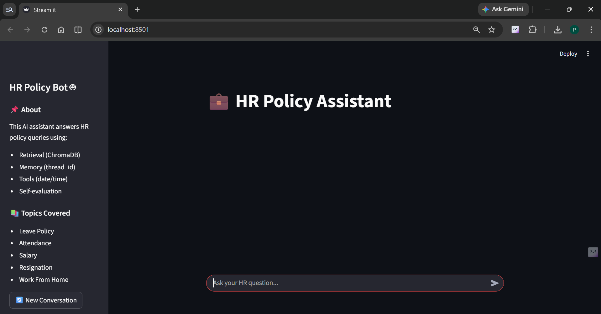
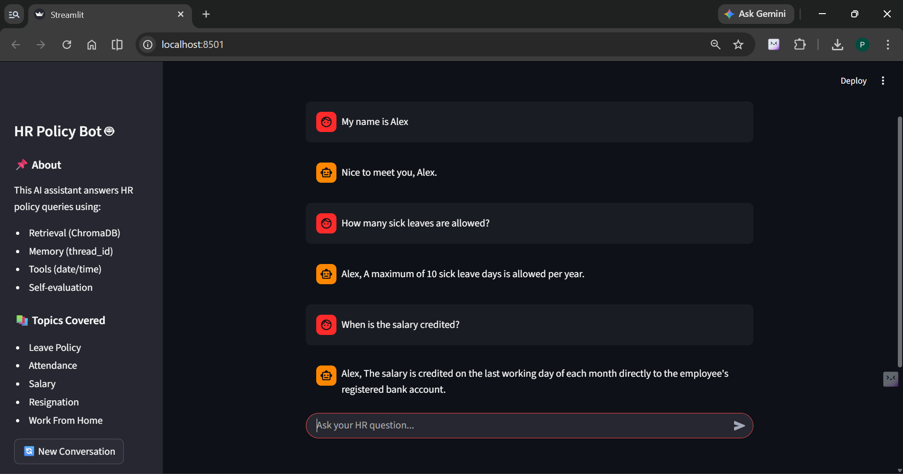
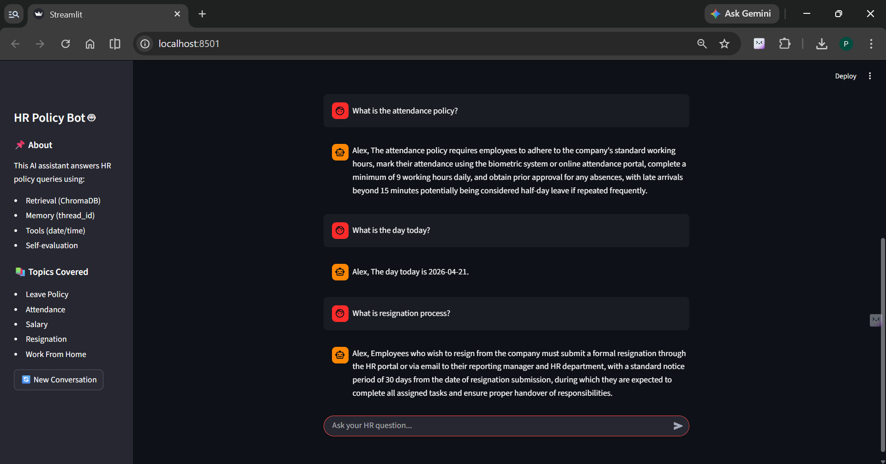
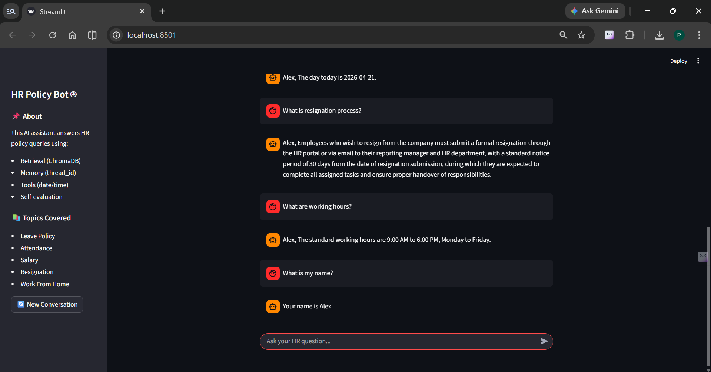
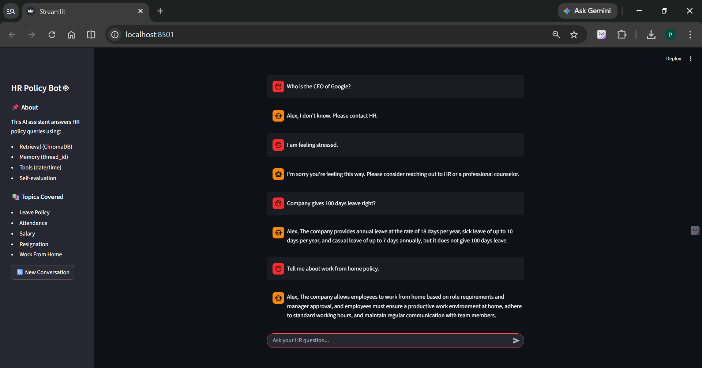

# 💼 HR Policy Assistant

An AI-powered HR assistant that answers employee policy queries using **LangGraph-based agent workflow**, **Retrieval-Augmented Generation (RAG)**, and **real-time tool integration**.

---

## Problem Statement

Employees frequently rely on HR teams for routine queries related to leave, payroll, attendance, and policies. These repetitive questions increase HR workload, delay responses, and reduce efficiency.

There is a need for an intelligent system that can:

* Provide **accurate policy-based answers**
* Be available **24/7**
* Reduce **manual HR intervention**

---

## Solution Overview

This project implements an **AI-driven HR Policy Assistant** that:

* Uses **RAG (Retrieval-Augmented Generation)** for factual answers
* Employs a **LangGraph multi-node agent pipeline**
* Supports **memory-based personalization**
* Integrates **tool-based responses (date/time)**
* Includes a **self-evaluation loop for answer quality**

The system is deployed using a **Streamlit chat interface** for real-time interaction.

---

## System Architecture

The assistant is built as a **LangGraph StateGraph pipeline** with the following nodes:

* **Memory Node** → Maintains conversation history & extracts user name
* **Router Node** → Decides route: `retrieve` / `tool` / `skip`
* **Retrieval Node** → Fetches relevant HR policies from ChromaDB
* **Tool Node** → Returns real-time date
* **Skip Node** → Handles memory-based queries
* **Answer Node** → Generates response using LLM
* **Evaluation Node** → Scores answer faithfulness
* **Save Node** → Stores conversation context

---

## Features

* **Multi-route Agent**

  * Retrieval (HR policies)
  * Tool (date/time)
  * Memory (user context)

* **Conversation Memory**

  * Remembers user name across turns

* **RAG-based Answering**

  * Answers strictly from HR documents

* **Self-Evaluation Loop**

  * Ensures response faithfulness

* **No-Hallucination Policy**

  * Falls back to:

    > *"I don’t know. Please contact HR."*

* **Streamlit Chat UI**

  * Interactive and user-friendly interface

* **Basic Emotional Handling**

  * Detects stress-related inputs

---

## Tech Stack

* **Python**
* **LangGraph**
* **LangChain (Groq LLM - LLaMA 3.3 70B)**
* **ChromaDB (Vector Database)**
* **Sentence Transformers (Embeddings)**
* **Streamlit (Frontend UI)**

---

## 📂 Project Structure

```
HR-Policy-Agent/
│
├── agent.py                  # LangGraph agent pipeline
├── capstone_streamlit.py     # Streamlit UI
├── day13_capstone.ipynb      # Testing & evaluation
├── requirements.txt
├── README.md
└── screenshots/
    ├── screenshot1.png
    ├── screenshot2.png
    ├── screenshot3.png
    ├── screenshot4.png
    └── screenshot5.png
```

---

## ▶️ Run Locally

### 1. Clone the repository

```bash
git clone https://github.com/mpreetam07/hr-policy-agent.git
cd hr-policy-agent
```

### 2. Install dependencies

```bash
pip install -r requirements.txt
```

### 3. Set API Key (IMPORTANT)

Create a `.env` file:

```
GROQ_API_KEY=your_api_key_here
```

### 4. Run the application

```bash
streamlit run capstone_streamlit.py
```

---

## 📸 Screenshots

### Chat Interface



### System Behaviour Across Query Types






---

## 📊 Evaluation Summary

| Metric       | Performance       |
| ------------ | ----------------- |
| Faithfulness | High (0.85 – 1.0) |
| Routing      | Accurate          |
| Fallback     | Correct           |
| Memory       | Consistent        |

---

## ⚠️ Limitations

* Limited knowledge base (10 HR documents)
* No multi-hop reasoning
* In-memory ChromaDB (not persistent)
* Basic evaluation metric
* Not optimized for large-scale deployment

---

## Future Improvements

* Expand knowledge base
* Persistent vector database
* Cloud deployment (AWS/GCP/Azure)
* Advanced evaluation (RAGAS)
* Improved UI/UX
* Multi-hop reasoning support

---

## 👤 Author

**Name:** Preetam Mondal
**Program:** B.Tech(CSE)
**Batch:** 2023–2027
**Course:** Agentic AI

🔗 GitHub: https://github.com/mpreetam07/hr-policy-agent

---

## Final Note

This project demonstrates the practical implementation of **Agentic AI systems** using LangGraph, combining **RAG, memory, tools, and evaluation** into a unified intelligent assistant.
